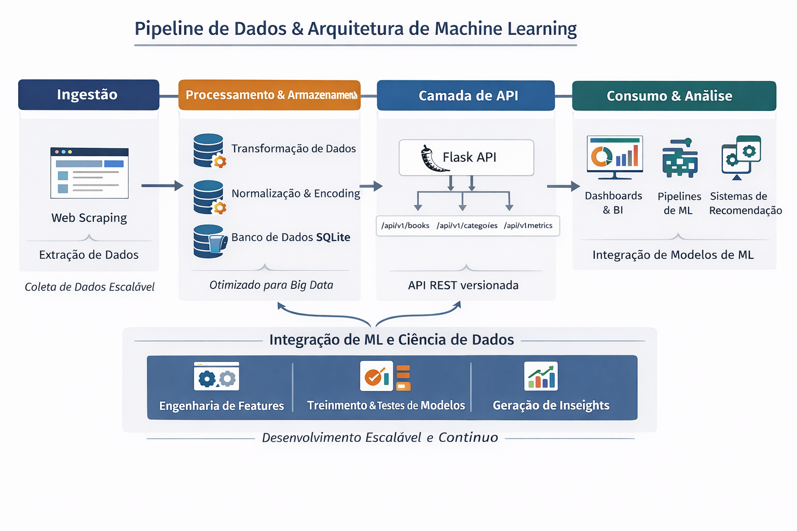

# 📚 Books Tech Challenge


> 🔗 **API pública:** [https://books-tech-challenge.onrender.com/api/v1/](https://books-tech-challenge.onrender.com/api/v1/)

> 📊 **Dashboard público:** [https://books-tech-challenge.onrender.com/api/v1/](https://books-tech-dashboard.onrender.com)

API RESTful para ingestão, persistência e exposição de dados de livros, com foco em **engenharia de dados** e **Machine Learning**. O projeto demonstra boas práticas de arquitetura, documentação e segurança, estando preparado para evolução em ambientes de produção.

---

## ✨ Visão Geral

O **Books Tech Challenge** é uma API desenvolvida em **Python** com **Flask** e **Flask-RESTX**, responsável por fornecer dados de uma coleção fictícia de livros. A solução cobre todo o ciclo de dados — da ingestão (scraping simulado) ao consumo por aplicações, dashboards e pipelines de Machine Learning.

### Principais funcionalidades

* 📥 **Ingestão de dados** (scraping simulado)
* 🗄️ **Persistência** em banco SQLite
* 🔐 **Autenticação JWT** para rotas sensíveis
* 📊 **Estatísticas e métricas** da coleção
* 🤖 **Endpoints para Machine Learning** (features, dataset e predições)
* 📈 **Dashboard de monitoramento** (Streamlit)
* 📖 **Documentação automática** via Swagger (OpenAPI)

---

## 🌐 Ambiente Público (API Online)

O projeto está disponível publicamente, permitindo **demonstração técnica, testes e avaliação de arquitetura**, sem necessidade de execução local.

* **Base URL da API:**
  [https://books-tech-challenge.onrender.com/api/v1/](https://books-tech-challenge.onrender.com/api/v1/)

* **Swagger UI (Documentação Interativa):**
  [https://books-tech-challenge.onrender.com/api/v1/](https://books-tech-challenge.onrender.com/api/v1/)

* **URL pública do Dashboard:**
  [https://books-tech-dashboard.onrender.com/](https://books-tech-dashboard.onrender.com)

> ℹ️ Tanto a API quanto o dashboard utilizam infraestrutura gratuita (Render).
Em períodos de inatividade, pode ocorrer cold start, fazendo com que a primeira requisição leve alguns segundos.

---

## ⚡ Quick Test

Teste a API diretamente pelo navegador ou via `curl`:

```bash
curl https://books-tech-challenge.onrender.com/api/v1/books/
```

Ou acesse o Swagger e execute as requisições pela interface gráfica.

Teste o Dashboard pelo navegador

```arduino
https://books-tech-dashboard.onrender.com/
```

---

## 🏗️ Arquitetura

A arquitetura foi pensada para ser simples, modular e extensível, permitindo fácil evolução para cenários de maior escala e integração com pipelines de dados e Machine Learning.



**Fluxo principal:**

1. Ingestão (scraping simulado ou pipeline externo)
2. Processamento e validação dos dados
3. Persistência no banco de dados
4. Exposição via API REST
5. Consumo por aplicações, dashboards e pipelines de ML

---

## 🧰 Stack Tecnológica

* **Python 3.12+**
* **Flask** + **Flask-RESTX**
* **SQLite**
* **JWT (JSON Web Token)**
* **Pytest** (testes)
* **Streamlit** (dashboard)
* **Swagger / OpenAPI** (documentação)

---

## 🚀 Instalação e Execução (Local)

### Pré-requisitos

* Python 3.12 ou superior
* Git
* Poetry **ou** pip + venv

### Clonando o repositório

```bash
git clone https://github.com/seu-usuario/books-tech-challenge.git
cd books-tech-challenge
```

### Usando Poetry (recomendado)

```bash
poetry install
poetry shell
```

### Ou usando venv + pip

```bash
python -m venv venv
source venv/bin/activate  # Linux/Mac
venv\\Scripts\\activate     # Windows
pip install -r requirements.txt
```

---

## ▶️ Executando a API Localmente

```bash
poetry run python api/app.py
```

A API estará disponível em:

* **API:** [http://127.0.0.1:5000/api/v1/](http://127.0.0.1:5000/api/v1/)
* **Swagger UI:** [http://127.0.0.1:5000/api/v1/](http://127.0.0.1:5000/api/v1/)

---

## ▶️ Executando o Dashboard Localmente

```bash
streamlit run dashboard/app.py
```

O Dashboard estará disponível em:

```arduino
http://localhost:8501
```

---

## 🗄️ Banco de Dados

* O banco **SQLite** é criado automaticamente na primeira execução da API
* Arquivo gerado: `books.db`

### Popular o banco (scraping simulado)

Endpoint protegido por JWT:

```http
POST /api/v1/scraping/trigger
Authorization: Bearer <ACCESS_TOKEN>
```

---

## 🔐 Autenticação JWT

### Login

```http
POST /api/v1/auth/login
Content-Type: application/json
```

```json
{
  "username": "admin",
  "password": "admin123"
}
```

### Renovação de token

```http
POST /api/v1/auth/refresh
Authorization: Bearer <REFRESH_TOKEN>
```

---

## 📡 Endpoints da API

### 📘 Books

* `GET /api/v1/books/` — Lista todos os livros
* `GET /api/v1/books/<id>/` — Detalhe de um livro por ID
* `GET /api/v1/books/search/` — Busca por título e/ou categoria
* `GET /api/v1/books/top-rated/` — Livros melhor avaliados
* `GET /api/v1/books/price-range/` — Filtro por faixa de preço
* `GET /api/v1/books/stats/` — Estatísticas da coleção

### 🗂️ Categories

* `GET /api/v1/categories/` — Lista categorias
* `GET /api/v1/categories/<name>/` — Livros por categoria

### ❤️ Health Check

* `GET /api/v1/health/` — Status da API e conexão com o banco

### 📊 Stats

* `GET /api/v1/stats/overview/` — Estatísticas gerais
* `GET /api/v1/stats/categories/` — Estatísticas por categoria

### 🤖 Machine Learning (opcional)

* `GET /api/v1/ml/features/` — Features prontas para análise
* `GET /api/v1/ml/training-data/` — Dataset completo
* `POST /api/v1/ml/predictions/` — Recebe predições de modelos ML

### 🔒 Scraping (protegido)

* `POST /api/v1/scraping/trigger/` — Dispara ingestão de dados (mock)

---

## 🧪 Testes

```bash
pytest
```

---

## 🤖 Machine Learning & Data Science

Os endpoints de ML funcionam como **contrato de dados** para cientistas de dados e pipelines automatizados:

* Features prontas para exploração
* Dataset estruturado para treinamento
* Endpoint de predição para integração com modelos treinados

Esses recursos permitem integração direta com **notebooks**, **pipelines de treinamento** e **ambientes de experimentação**.

---

## 📌 Considerações Finais

Este projeto foi desenvolvido com foco em **engenharia de Machine Learning**, indo além de uma API CRUD tradicional. A arquitetura separa claramente ingestão, persistência, exposição e consumo de dados, permitindo escalabilidade e evolução futura.

Embora utilize **SQLite** por simplicidade, a estrutura suporta migração para bancos mais robustos e integração com pipelines reais de ingestão e modelos em produção.

A disponibilidade de um **ambiente público**, aliada à documentação via **Swagger**, autenticação **JWT**, organização arquitetural, além de um Dashboard público, torna este projeto completo e com excelente maturidade técnica.

---

📄 **Licença:** MIT
